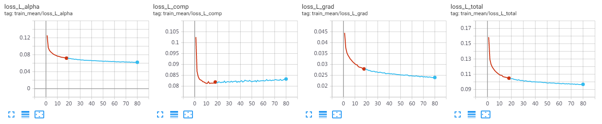

# Learning-based Sampling for Natural Image Matting

This project tries to reimplement the CVPR2019 paper _Learning-based Sampling for Natural Image Matting_ by Tang et al.
The original paper can be found [here](http://yaksoy.github.io/samplenet/).

## Requirements

* pytorch==1.2.0
* opencv2
* numpy
* tqdm
* imgaug (for training only)

## Usage

* Clone this project and download weight from: https://1drv.ms/u/s!AuG441T6ysq5g1DHKEY4DJGkJh-c?e=i9nFph
* Extract weight to the root folder of this project.

### Evaluation

* Data folder example:
```
    /path/to/data/folder:
        |-rgb
            |-XXXXX.png
            |-YYYYY.png
            |-ZZZZZ.png
            |-...
        |-trimap
            |-XXXXX.png
            |-YYYYY.png
            |-ZZZZZ.png
            |-...
        |-val_set.txt
```
In `val_set.txt`, every sample takes exactly one line.
Every line contains two items, the first item is the original image, the second item is the corresponding trimap. The two items are separated with space. e.g.:
```
rgb/XXXXX.png trimap/XXXXX.png
rgb/YYYYY.png trimap/YYYYY.png
rgb/ZZZZZ.png trimap/ZZZZZ.png
...
```

* Run `inference.py`:
```
python3 inference.py --eval /path/to/data/folder --out /path/to/output/folder --size WxH
```
Note that `W` and `H` must be a multiple of 32, and all images will be **DIRECTLY RESIZED TO** `WxH` for inference. The output will be resized back to the original size.

### Training (under construction)

Currently `train.py` can only train the alpha matting module. You need to obtain the DIM dataset first.

## Some training detail

* Augmentation strategy are mostly the same as the original paper. We use larger dilation size during matting module training.
* Both BG and FG sampling module are loaded with pretrained DeepFillv1 weights provided [here](https://github.com/nbei/Deep-Flow-Guided-Video-Inpainting) then trained on DIM dataset for 40 epochs.
* The matting module are trained on DIM dataset for 80 epochs.
    * The ImageNet pretrained Resnet-50 weight also can be found [here](https://github.com/nbei/Deep-Flow-Guided-Video-Inpainting).
    * Learning rate is constantly 1e-5 with Adam optimizer. Weight decay is 1e-4.
    * Input shape is 640x640, batch size is 32, we **DID NOT USE SYNCBN**.
    * Both BG and FG sampling module is **FREEZED** during training.
* Training loss curve:

The composition loss is getting higher over the time due to the imperfect BG/FG sampling result.

## Acknowledgement

* DeepFill and Resnet-50 code is borrowed and slight altered from: https://github.com/nbei/Deep-Flow-Guided-Video-Inpainting 
* ASPP module code is borrowed and slight altered from: https://github.com/fregu856/deeplabv3/blob/master/model/aspp.py

## License

MIT License